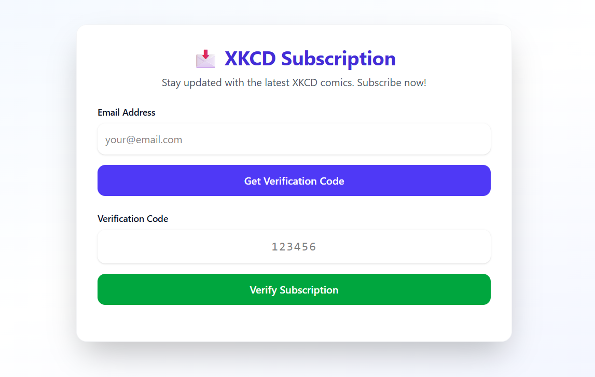
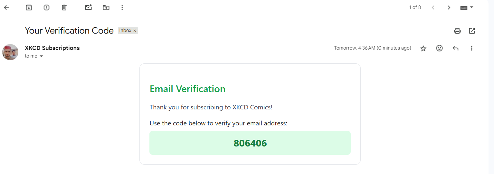
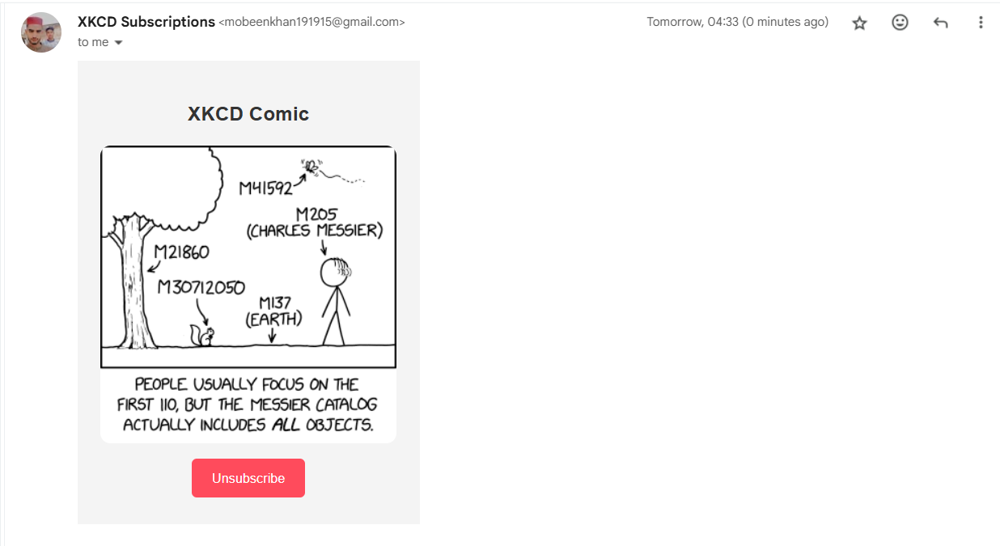
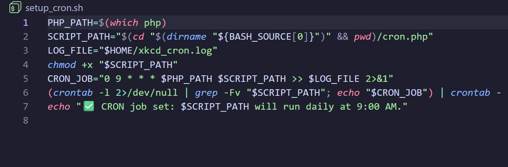

# 📬 XKCD Email Subscription System

A PHP-based email verification system where users register using their email, receive a 6-digit verification code, and subscribe to get a random XKCD comic every day. A CRON job fetches a random XKCD comic and sends it to all registered users every 24 hours.

This project uses PHPMailer for reliable email delivery and stores registered emails in a simple text file (`registered_emails.txt`) - no database required!


## **Live Demo:** https://email-verification-fkfa.onrender.com


## 🚀 Features

### ✅ Email Verification
- Users enter email → Receive 6-digit code → Enter code → Get registered
- Verified emails are stored in `registered_emails.txt`

### ✅ Unsubscribe Feature  
- Emails contain an unsubscribe link
- Clicking it sends a confirmation code → Users confirm unsubscription
- Email is removed from `registered_emails.txt`

### ✅ XKCD Comic Delivery (CRON)
- A CRON job runs every 24 hours
- Fetches a random XKCD comic from `https://xkcd.com/[randomComicID]/info.0.json`
- Sends comic in HTML email format to all subscribers

### ✅ Lightweight (No Database)
- Uses `registered_emails.txt` as storage
- Easy to deploy anywhere (e.g., Render, cPanel, VPS)

## 📂 Project Structure

```
src/
├── index.php                 # Main subscription page with email verification forms
├── unsubscribe.php          # Unsubscribe functionality with code verification
├── functions.php            # Core business logic (all required functions)
├── cron.php                 # CRON job script for sending XKCD comics
├── setup_cron.sh           # Automated CRON job setup script
├── registered_emails.txt    # Stores verified subscriber emails (database-free)
├── Dockerfile              # Docker containerization for Render deployment
├── composer.json           # PHPMailer dependencies configuration
├── composer.lock           # Locked dependency versions  
└── vendor/                 # PHPMailer and Composer dependencies
```

## ⚙️ Setup Instructions

### 1️⃣ Clone Repository

```bash
git clone <your-repository-url>
cd xkcd-email-system/src
```

### 2️⃣ Install Dependencies

This project uses PHPMailer for reliable email delivery. Install via Composer:

```bash
composer install
```

If you don't have Composer installed, download it from [getcomposer.org](https://getcomposer.org/)

**Required packages:**
- `phpmailer/phpmailer` - SMTP email handling

### 3️⃣ Configure SMTP Settings

Create a `.env` file in the `src/` folder with your SMTP configuration:

```env
SMTP_HOST=smtp.gmail.com
SMTP_PORT=587
SMTP_USERNAME=your_email@gmail.com
SMTP_PASSWORD=your_app_password
SMTP_SECURE=tls
FROM_EMAIL=no-reply@example.com
FROM_NAME=XKCD Comic Bot
```

> ⚠️ **For Gmail users**: You must enable App Passwords (if 2FA is enabled):
> 1. Go to Google Account Settings → Security
> 2. Enable 2-Step Verification 
> 3. Generate App Password for "Mail"
> 4. Use the generated password in `SMTP_PASSWORD`

### 4️⃣ Set File Permissions

Ensure the web server can write to the registration file:

```bash
touch registered_emails.txt
chmod 664 registered_emails.txt
```

### 5️⃣ Running Locally

Start PHP's built-in development server:

```bash
php -S localhost:8000
```

Open in browser: **👉 https://localhost:8000**

### 6️⃣ CRON Job Setup

Run the automated setup script to configure the CRON job:

```bash
chmod +x setup_cron.sh
./setup_cron.sh
```

This will automatically add a CRON job that runs every 24 hours to send XKCD comics.

**Manual CRON setup (if needed):**
```bash
# Edit crontab
crontab -e

# Add this line for daily execution at 9 AM
0 9 * * * /usr/bin/php /path/to/project/src/cron.php >> /path/to/project/cron.log 2>&1
```

## 🌍 Deployment Options

This project can be deployed on:

- **Render / Vercel** (PHP Runtime)
- **cPanel Hosting** 
- **VPS / Bare-metal server** with Apache/Nginx + PHP
- **Shared hosting** with PHP support

### 🚀 Render.com Deployment (Recommended)

#### Step 1: Prepare for Deployment
1. Push your code to GitHub/GitLab repository
2. Ensure `Dockerfile` is in the root directory

#### Step 2: Create Web Service on Render
1. Go to [Render Dashboard](https://dashboard.render.com)
2. Click **"New"** → **"Web Service"**
3. Connect your GitHub/GitLab repository
4. Configure deployment settings:
   - **Name**: `xkcd-subscription`
   - **Environment**: `Docker`
   - **Region**: Select closest to your users
   - **Branch**: `main` (or your default branch)

#### Step 3: Set Environment Variables
In Render dashboard, add these environment variables:
```env
SMTP_HOST=smtp.gmail.com
SMTP_PORT=587
SMTP_USERNAME=your-email@gmail.com
SMTP_PASSWORD=your-app-password
SMTP_FROM=your-email@gmail.com
SMTP_FROM_NAME=XKCD Comics
```

#### Step 4: Deploy
1. Click **"Create Web Service"**
2. Wait for deployment to complete (5-10 minutes)
3. Your app will be live at `https://your-app-name.onrender.com`

### ⏰ CRON Job Setup for Render

#### Option 1: Render Cron Jobs (Recommended for Render)
1. **Create Cron Job Service**:
   - Go to Render Dashboard → **"New"** → **"Cron Job"**
   - Connect same repository
   - Configure settings:
     - **Name**: `xkcd-daily-cron`
     - **Environment**: `Docker`
     - **Command**: `php /var/www/html/cron.php`
     - **Schedule**: `0 9 * * *` (daily at 9 AM UTC)

2. **Add Environment Variables**: Copy all SMTP variables from your web service

#### Option 2: External Cron Services
Use third-party cron services:
- **EasyCron**: https://www.easycron.com
- **cron-job.org**: https://cron-job.org  
- **UptimeRobot**: Monitor + webhook functionality

**Setup**: Create HTTP GET request to `https://your-app.onrender.com/cron.php` with daily schedule

#### Option 3: Local Server CRON (For VPS/Dedicated Servers)
Use the included `setup_cron.sh` script:
```bash
chmod +x setup_cron.sh
./setup_cron.sh
```

### 🔍 CRON Monitoring & Status Check

#### For Render Cron Jobs:
1. **Dashboard Monitoring**:
   - Go to Render Dashboard → Your Cron Job Service
   - Check **"Events"** tab for execution history
   - View **"Logs"** tab for detailed output

2. **Manual Trigger** (Testing):
   ```bash
   # Access your web service via browser/curl
   https://your-app.onrender.com/cron.php
   ```

#### For External Cron Services:
- Check respective service dashboard for execution logs
- Most services provide email alerts for failed executions

#### For Local CRON:
```bash
# Check installed cron jobs
crontab -l

# View cron execution logs  
tail -f ~/xkcd_cron.log

# Test cron script manually
php cron.php

# Check cron service status
sudo systemctl status cron
```

### Deployment Checklist

- [ ] Place project files in your web directory (e.g., `/var/www/html/`)
- [ ] Configure `.env` with your SMTP credentials  
- [ ] Set proper file permissions for `registered_emails.txt`
- [ ] Set up CRON job to run `cron.php` every 24 hours
- [ ] Test email sending functionality
- [ ] Verify XKCD API access
- [ ] **For Render**: Verify both web service and cron job are running
- [ ] **For Render**: Check environment variables are properly set

## 📩 Email Formats

### Verification Email
**Subject:** Your Verification Code

```html
<p>Your verification code is: <strong>123456</strong></p>
```

### XKCD Comic Email  
**Subject:** Your XKCD Comic

```html
<h2>XKCD Comic</h2>

<p><a href="#" id="unsubscribe-button">Unsubscribe</a></p>
```

### Unsubscribe Confirmation Email
**Subject:** Confirm Un-subscription

```html
<p>To confirm un-subscription, use this code: <strong>654321</strong></p>
```

## 🔧 Configuration Options

### Email Frequency
To change how often comics are sent, modify the CRON schedule in `setup_cron.sh` or manually:

```bash
# Daily at 9 AM (default)
0 9 * * * /usr/bin/php /path/to/project/src/cron.php

# Every 12 hours
0 */12 * * * /usr/bin/php /path/to/project/src/cron.php

# Weekly on Sundays at 8 AM
0 8 * * 0 /usr/bin/php /path/to/project/src/cron.php
```

### SMTP Providers
The system uses PHPMailer with SMTP authentication. Popular providers:

| Provider | Host | Port | Security | Notes |
|----------|------|------|----------|-------|
| Gmail | smtp.gmail.com | 587 | TLS | Requires App Password |
| Outlook | smtp-mail.outlook.com | 587 | STARTTLS | Personal/Business accounts |
| SendGrid | smtp.sendgrid.net | 587 | TLS | API key as password |
| Mailgun | smtp.mailgun.org | 587 | TLS | Domain verification required |
| Yahoo | smtp.mail.yahoo.com | 587 | TLS | App Password required |

## 🛠 Built With

- **PHP 8.3+** (Recommended version)
- **PHPMailer** - Professional SMTP email handling
- **XKCD API** - Comic data source (https://xkcd.com/[randomComicID]/info.0.json)  
- **CRON** - Automated task scheduling (24-hour intervals)
- **Composer** - Dependency management
- **Docker** - Containerization for Render deployment

## 🔍 Troubleshooting

### Common Issues

**Emails not sending:**
- Verify SMTP credentials in `.env` file
- Check if PHPMailer is properly installed (`composer install`)
- Test SMTP connection manually
- Check firewall allows outbound SMTP connections (port 587/465)
- Verify email provider settings (Gmail App Password, etc.)
- Check `cron.log` for PHPMailer error messages

**SMTP Authentication failures:**
- Ensure App Passwords are enabled (Gmail, Yahoo)
- Verify username/password combination
- Check if 2FA is properly configured
- Test with different SMTP providers

**CRON job not running:**
- Verify crontab entry with `crontab -l`
- Check if `setup_cron.sh` executed successfully
- Ensure PHP path is correct (`which php`)
- Check system cron service is running
- Verify file permissions for `cron.php`
- **For Render**: Check cron job service logs in dashboard
- **For External Services**: Verify webhook URL is accessible

**Render-specific issues:**
- Check environment variables are set in both web service AND cron job
- Verify Docker build logs for any errors
- Ensure `registered_emails.txt` has proper write permissions
- Test manual cron execution via browser: `your-app.onrender.com/cron.php`

**File permission errors:**
- Ensure web server can write to `registered_emails.txt`
- Check ownership: `chown www-data:www-data registered_emails.txt`

## 📸 Screenshots

### Application Interface

*Main subscription interface with email input and verification forms*

### Email Examples

*Example of verification code email sent to users*


*Example of daily XKCD comic email with unsubscribe option*

### CRON Job Setup

*Automated CRON job configuration via setup script*

> **Note:** Add your screenshots to a `screenshots/` folder in your repository and update the image paths above.

## 🗓 Future Enhancements

- [ ] Add database support (MySQL/PostgreSQL)
- [ ] Implement user dashboard
- [ ] Add preference settings (comic frequency, categories)
- [ ] Mobile-responsive design improvements
- [ ] Rate limiting for verification attempts
- [ ] Email templates with better styling

## 🤝 Contributing

1. Fork the repository
2. Create a feature branch (`git checkout -b feature/amazing-feature`)
3. Commit your changes (`git commit -m 'Add amazing feature'`)
4. Push to the branch (`git push origin feature/amazing-feature`)  
5. Open a Pull Request

## 📜 License

This project is licensed under the MIT License - see the [LICENSE](LICENSE) file for details.

## 🔗 Links

- **Live Demo:** https://email-verification-fkfa.onrender.com
- **XKCD Official:** https://xkcd.com
- **PHPMailer Documentation:** https://github.com/PHPMailer/PHPMailer
- **Render Documentation:** https://render.com/docs

---

Made with ❤️ by **Mobeen Khan** | © 2025